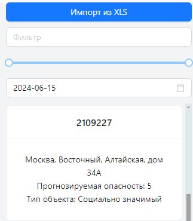
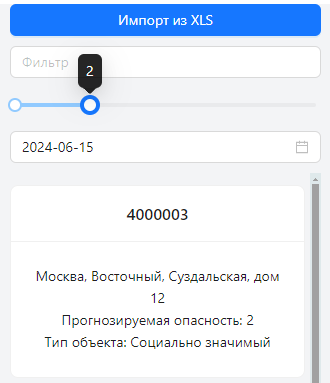
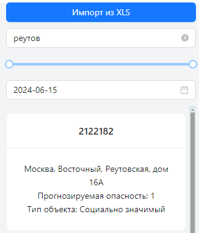
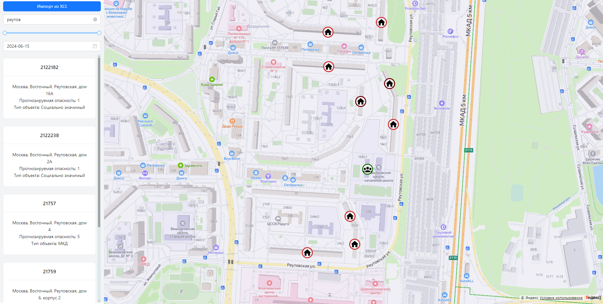
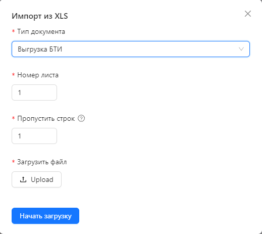
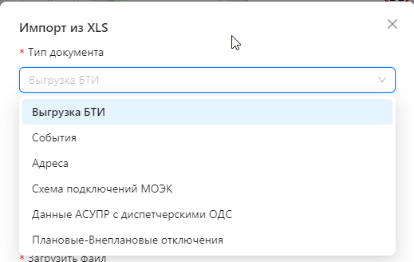
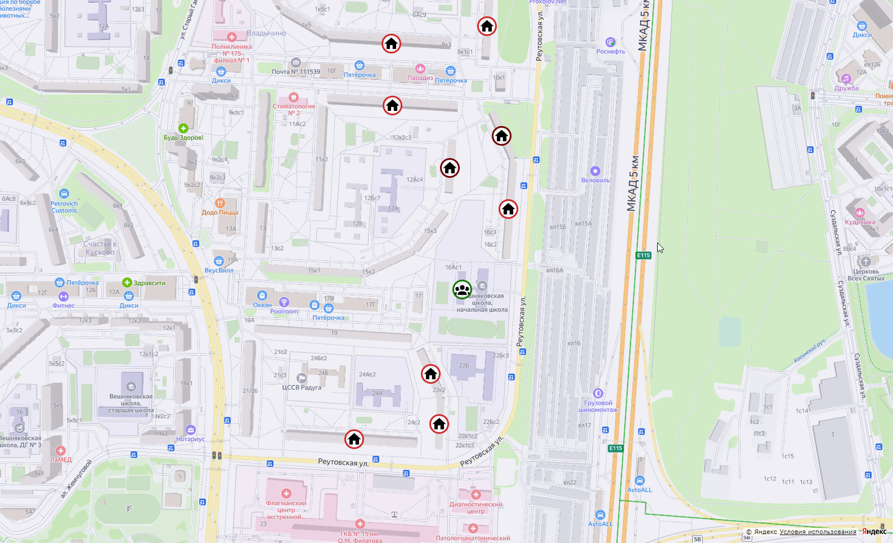
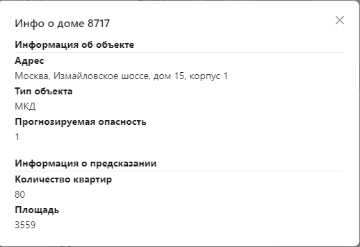
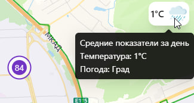

# Инструкции по запуску
1. Создайте и заполните файл `.env`
2. Соберите Docker-образ командой: `docker build -t <название> .`
3. Запустите образ с помощью команды: `docker run -p 80:80 <название>`
4. Запустите образы ML и Backend службы

# Обзор приложения
Данное приложение предоставляет возможность просмотра данных о прогнозируемых аварийных ситуациях. Оно состоит из четырех ключевых компонентов: бокового меню, карты, загрузки данных и информации о здании.

## Боковое меню
Боковое меню отображает сущности в виде списка, где для каждой карточки сущности можно получить подробную информацию через диалоговое окно при клике. Также присутствуют инструменты для фильтрации данных.
Уровень опасности для зданий отображается числом от 1 до 5, где более высокое значение соответствует большей вероятности аварийной ситуации. С помощью слайдера можно отфильтровать данные по уровню опасности. Также доступен текстовый фильтр для более точной настройки отображаемых данных. Все фильтры синхронизируются с данными, отображаемыми на карте.
Кроме того, в боковом меню можно выбрать дату, чтобы запросить у модели предсказания на определённый день.

## Загрузка данных
В боковом меню также расположена кнопка "Импорт из XLS", позволяющая загружать дополнительные данные в приложение.

## Карта
На карте отображаются сущности в виде иконок с возможностью получения подробной информации при клике. Типы зданий - социально значимые, промышленные и многоквартирные дома (МКД) - представлены разными иконками. Уровень опасности обозначен цветом иконки: от зелёного (наименее опасного) до красного (наиболее опасного).
В правом верхнем углу карты отображается информация о температуре и погоде на день предсказания.

# Технологии в приложении

- React https://react.dev/
- TypeScript https://www.typescriptlang.org/
- Vite https://vitejs.dev/
- Tailwind https://tailwindcss.com/
- Ant https://ant.design/
- Яндекс.Карты https://yandex.ru/maps-api/
